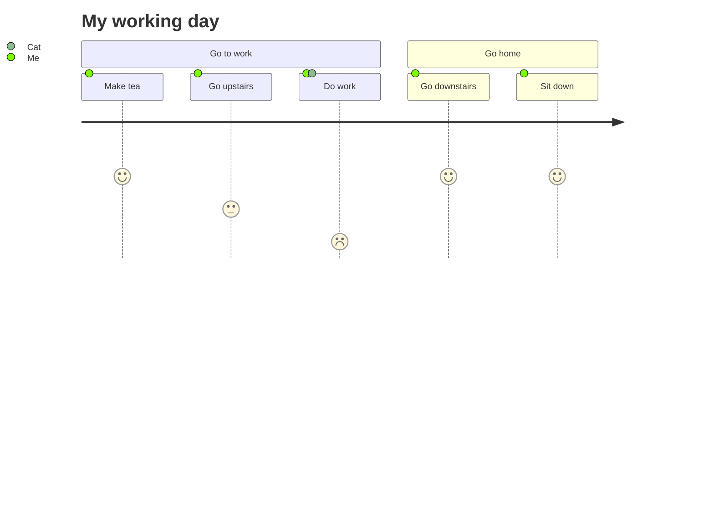

> Mermaid v12.1.0 · source: packages/mermaid/src/docs/syntax/userJourney.md · header: `journey` · since 8.0.0

# User Journey Diagram

```mermaid
journey
    title My working day
    section Go to work
      Make tea: 5: Me
      Go upstairs: 3: Me
      Do work: 1: Me, Cat
    section Go home
      Go downstairs: 5: Me
      Sit down: 5: Me
```
